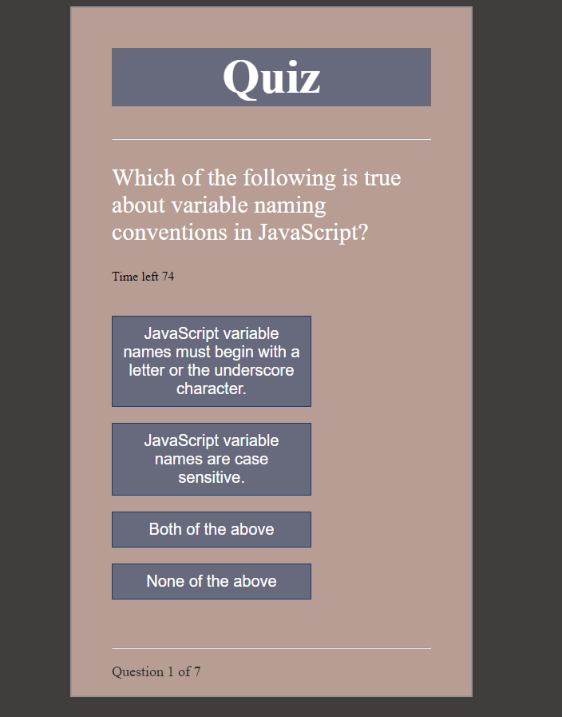

# HW-04-web-apis
This is a repository for the code and all the assets for a JS quiz

The objective of this program was to create a responsive quiz app on a timer that tests the users knowledge of JS

I used constructors to achieve this. The first creates an object  called Question list that tracks total score displays the question and tracks the index of the questions.
The second creates a questions object  that that tracks text, options and the user's answer. 

Below is a screenshot and link to the deployed app.

https://thecoaxial.github.io/HW-04-web-apis/

